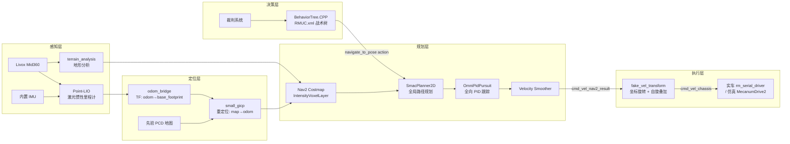

[](https://opensource.org/licenses/Apache-2.0)


# Sentry26 — RoboMaster 哨兵机器人 ROS2 自主导航系统

RoboMaster 2026 赛季哨兵机器人 ROS2 自主导航系统。**全向 (Mecanum) 底盘 + 独立云台 + 持续自旋**,基于 ROS2 Jazzy + Nav2 + BehaviorTree.CPP / BehaviorTree.ROS2 + Livox Mid360,**仿真 (Gazebo Harmonic) 与实车并存**。

- **Maintainer**: boombroke <2218681402@qq.com>
- **基于**: [pb2025_sentry_nav](https://github.com/SMBU-PolarBear-Robotics-Team/pb2025_sentry_nav)(Lihan Chen 等)二次开发并适配 RM2026 赛季
- **当前分支**: `feat/robot_model_sync`

## 系统架构



### 速度指令链路

```
controller_server (在 gimbal_yaw_fake 系规划, TwistStamped)
  → cmd_vel_controller
    → velocity_smoother (限速 / 限加速, TwistStamped)
      → cmd_vel_nav2_result
        → fake_vel_transform (旋回 gimbal_yaw 真实系 + 叠加 spin_speed)
          → cmd_vel_chassis (Twist)
            ├─ 实车: rm_serial_driver 订阅 /cmd_vel_chassis,封 Control 包下发底盘
            └─ 仿真: spawn_robots.launch.py 中 robot_base 节点 remap(cmd_vel→cmd_vel_chassis)
                     → Gazebo MecanumDrive2 插件
```

> 判断 Nav2 是否走直线,看 `cmd_vel_nav2_result`(world/fake 系);`cmd_vel_chassis` 是旋回 body 系并叠加自旋后的最终底盘指令。

### TF 树

```
map → odom → base_footprint → chassis → gimbal_yaw → gimbal_pitch → front_mid360
                                          ↓
                                    gimbal_yaw_fake (Nav2 规划用虚拟 frame)
```

底盘持续自旋时 `gimbal_yaw` 实时变化,`gimbal_yaw_fake` 与 `gimbal_yaw` 反向旋转,使 Nav2 规划目标点在惯性系上稳定。`fake_vel_transform` 在执行端把 Nav2 输出从 fake 系旋回真实系并叠加 `spin_speed` 给底盘。

## 功能特性

- **全向底盘 + 持续自旋**:四麦轮(`MecanumDrive2`)任意方向平移;底盘可固定 `spin_speed` 持续自旋(实车默认 3.14 rad/s;仿真 `init_spin_speed` 默认 0,可配),云台反向跟随保持指向稳定。
- **决策层走 Nav2 action**:`sentry_behavior` 的 `NavigateTo`(继承 `BT::RosActionNode<NavigateToPose>`)直接调用 nav2 `navigate_to_pose` action,拿到真实 SUCCESS/FAILURE 与 feedback,不依赖 `/goal_pose` topic 的"立即 SUCCESS"语义。
- **Reactive 决策树**:`RMUC.xml` 用 `WhileDoElse + KeepRunningUntilFailure(NavigateTo) + AlwaysSuccess` 组合,状态条件(弹丸 / 血量,来自裁判系统)变化时立刻 halt 当前导航并切换路径。
- **高频定位**:Point-LIO 激光惯性紧耦合里程计 + small_gicp 先验地图全局重定位。
- **地形感知**:基于 intensity 的体素代价层(`IntensityVoxelLayer`)+ `BackUpFreeSpace` 自由空间后退恢复。
- **仿真 + 实车双栈**:Gazebo Harmonic 全场景(rmuc_2025 / rmuc_2026 / rmul_2026);裁判系统/多机对抗为可选项(默认关闭)。
- **工具链**:串口 Mock、地图坐标拾取、串口实时数据可视化、INV-1~7 决策树回归脚本。

## 目录结构

> 标 `[第三方]` 的为上游 / fork 包,本仓库仅集成、不重写其文档。其余为本项目自研 / 集成包。

```
src/
├── sentry_nav/                          # 导航核心包容器
│   ├── point_lio/                       #   [第三方] HKU-MARS Point-LIO 激光惯性里程计 (fork)
│   ├── odom_bridge/                     #   Point-LIO → TF(odom→base_footprint)/Odometry/registered_scan
│   ├── fake_vel_transform/              #   速度坐标变换 + 自旋叠加 (gimbal_yaw_fake)
│   ├── omni_pid_pursuit_controller/     #   全向 PID 纯跟踪控制器 (Nav2 controller plugin)
│   ├── nav2_plugins/                    #   IntensityVoxelLayer + BackUpFreeSpace
│   ├── small_gicp_relocalization/       #   先验 PCD 全局重定位 (map→odom)
│   ├── ign_sim_pointcloud_tool/         #   仿真 Mid360 点云 → velodyne 格式
│   ├── terrain_analysis/ , terrain_analysis_ext/  # [第三方] CMU 地形分析
│   ├── pointcloud_to_laserscan/         #   [第三方] 3D 点云 → 2D laser scan
│   ├── livox_ros_driver2/               #   [第三方] Livox Mid360 ROS2 驱动
│   └── sentry_nav/                      #   元包(依赖聚合)
├── sentry_nav_bringup/                  # Launch / Nav2 参数 / 地图 / PCD / RViz / Nav2 BT XML
├── sentry_behavior/                     # BehaviorTree 战术决策(RMUC.xml + 动作/条件插件)
├── sentry_match_recorder/               # 比赛期间自动 rosbag 录制(裁判 game_progress 触发)
├── sentry_robot_description/            # 机器人 SDF/xmacro 描述(含 MecanumDrive2 插件)
├── sentry_tools/                        # 串口 Mock / 地图坐标拾取 / 数据可视化(独立脚本, 非 ROS 包)
├── serial/serial_driver/                # rm_serial_driver(v3.0 多包协议)
├── rm_interfaces/                       # 自定义消息(裁判系统 / 视觉)
├── simulator/                           # [第三方] Gazebo Harmonic 仿真栈(rmu_gazebo_simulator / rmoss_gz_* / rmoss_interfaces / sdformat_tools)
├── BehaviorTree.ROS2/                   # [第三方] in-tree behaviortree_ros2 + btcpp_ros2_interfaces
├── third_party/                         # [第三方] 上游工具(Multi_LiCa 雷达标定等)
├── scripts/                             # 环境配置与修复脚本
└── docs/                                # 项目级文档
tests/                                   # INV-1~7 决策树回归脚本 + mock NavigateToPose action server
```

> 全量包清单:`find src -name package.xml | xargs grep '<name>'`(当前 28 个 ROS 包)。

## 环境要求

| 依赖 | 版本 |
|------|------|
| Ubuntu | 24.04 LTS |
| ROS2 | Jazzy |
| Gazebo | Harmonic (gz-sim 8) |
| C++ | C++17 |
| Python | 3.12+ |
| 硬件 | Livox Mid360 + 麦轮全向底盘 + IMU |

## 编译

```bash
# 一键配置环境(首次)
bash src/scripts/setup_env.sh

# 增量编译
colcon build --symlink-install --cmake-args -DCMAKE_BUILD_TYPE=Release
source install/setup.bash

# 单包编译
colcon build --packages-select sentry_behavior --symlink-install --cmake-args -DCMAKE_BUILD_TYPE=Release
```

> **OOM 预防**:`btcpp_ros2_interfaces` / `rm_interfaces` 等 IDL 包 Python binding 内存占用大,全量并行在 16G 内存机器上易 OOM,必要时加 `--parallel-workers 4` 或 `--executor sequential`。若编译报错,`src/scripts/fix_*.sh` 收录了常见修复(nav2 依赖 / libusb / pcl / ROS 环境 / 串口权限)。

## 快速开始

### 仿真模式(两步启动 / 时序敏感)

```bash
# 终端 1:启动 Gazebo(无头更稳:加 headless:=true)
ros2 launch rmu_gazebo_simulator bringup_sim.launch.py

# 仿真启动即暂停,解暂停(点 GUI 左下角播放键,或用服务):
gz service -s /world/default/control \
  --reqtype gz.msgs.WorldControl --reptype gz.msgs.Boolean \
  --timeout 5000 --req 'pause: false'

# 等 ~10s 让传感器/时钟稳定

# 终端 2:启动导航栈(首次用 slam:=True 实时建图,有图后切 False)
ros2 launch sentry_nav_bringup rm_navigation_simulation_launch.py \
  world:=rmuc_2026 slam:=True
```

支持世界:`rmuc_2025` / `rmuc_2026` / `rmul_2026`(默认 `rmuc_2025`)。仿真机器人命名空间默认 `red_standard_robot1`。

### 实车模式

```bash
# 一键(导航 + 串口 + 可选决策树)
ros2 launch sentry_nav_bringup rm_sentry_launch.py

# 或分步:建图
ros2 launch sentry_nav_bringup rm_navigation_reality_launch.py slam:=True use_robot_state_pub:=True

# 或分步:导航(需先验地图 + PCD)
ros2 launch sentry_nav_bringup rm_navigation_reality_launch.py slam:=False world:=<WORLD_NAME> use_robot_state_pub:=True
```

> 实车多进程编排见 `src/scripts/run_all.sh`(串口 + 导航 + 决策 + 串口抓包,`Ctrl+C` 统一停)。

## 主要参数(摘要)

| 参数 | 说明 | 默认值 |
|------|------|--------|
| `world` | 世界 / 地图名称 | `rmuc_2025` |
| `slam` | SLAM 建图模式(否则走先验图 + 重定位) | `False` |
| `namespace` | 机器人命名空间 | `red_standard_robot1`(仿真) |
| `use_rviz` | 启动 RViz | `True` |
| `headless` | Gazebo 无 GUI(仿真) | `False` |
| `enable_recorder` | 比赛自动录包(实车 launch) | `True` |
| `enable_behavior` | 启动 sentry_behavior 决策(实车 launch) | `False` |
| `target_tree` | 决策树名(XML 中的 BehaviorTree ID) | 见 `sentry_behavior` |

> 完整参数与默认值以各 launch 的 `DeclareLaunchArgument` 为准,详见 [sentry_nav_bringup README](src/sentry_nav_bringup/README.md)。

## 决策树回归测试

`tests/inv_smoke.sh` 用 mock NavigateToPose action server 验证 `RMUC.xml` 在七条不变量(INV-1~7)下的行为不变性(需先 `source install/setup.bash`):

```bash
source install/setup.bash
tests/inv_smoke.sh                          # 单跑全部 7 条
tests/inv_smoke.sh --baseline tests/baseline   # 录基线(重构前)
tests/inv_smoke.sh --regress  tests/baseline   # 回归对比(重构后)
```

七条不变量:阶段判定 / 首点压制 / 弹尽切补给 / 三段流转 / 阶段二驻守与回补给 / 比赛结束 / server 重启稳定性。

## 调试工具

```bash
# 串口 Mock + 地图坐标拾取(独立于 ROS)
python3 src/sentry_tools/sentry_toolbox.py

# 串口数据实时可视化(需 ROS 环境)
source install/setup.bash
python3 src/sentry_tools/serial_visualizer.py
```

详见 [sentry_tools 文档](src/sentry_tools/README.md)。

## 文档

| 文档 | 说明 |
|------|------|
| [快速部署指南](src/docs/QUICKSTART.md) | 从零环境搭建与首次运行 |
| [系统架构详解](src/docs/ARCHITECTURE.md) | 各模块数据流、坐标系、接口设计 |
| [运行模式说明](src/docs/RUNNING_MODES.md) | 仿真 / 实车 / 建图 / 导航模式 |
| [参数调优指南](src/docs/TUNING_GUIDE.md) | Point-LIO / Nav2 / OmniPidPursuit 调优 |
| [远程调试指南](src/docs/REMOTE_DEBUG.md) | Foxglove 远程可视化 |
| [决策树包说明](src/sentry_behavior/README.md) | RMUC.xml + NavigateTo + 条件插件 |
| [Nav2 启动包说明](src/sentry_nav_bringup/README.md) | launch / nav2_params 结构 |

## 致谢

导航主线基于 [深圳北理莫斯科大学 PolarBear 战队](https://github.com/SMBU-PolarBear-Robotics-Team) 的 [pb2025_sentry_nav](https://github.com/SMBU-PolarBear-Robotics-Team/pb2025_sentry_nav)(原作者 Lihan Chen 等);Point-LIO 来自 [HKU-MARS](https://github.com/hku-mars/Point-LIO);地形分析源自 CMU;仿真栈基于 [RoboMaster-OSS / rmoss](https://github.com/robomaster-oss)。当前由 boombroke 维护并适配 RoboMaster 2026 赛季。

## 许可证

Apache-2.0
