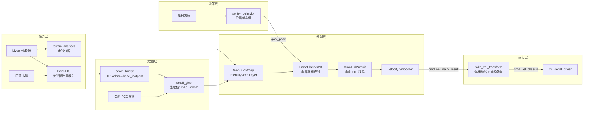

[](https://opensource.org/licenses/Apache-2.0)


# Sentry26 — RoboMaster 哨兵机器人 ROS2 自主导航系统

RoboMaster 2026 赛季哨兵机器人 ROS2 自主导航系统。**全向 (Mecanum) 底盘 + 独立云台 + 持续自旋**,基于 ROS2 Jazzy + Nav2 + 自研分层状态机决策 + Livox Mid360,纯实车运行。

- **Maintainer**: boombroke <2218681402@qq.com>
- **基于**: [pb2025_sentry_nav](https://github.com/SMBU-PolarBear-Robotics-Team/pb2025_sentry_nav)(Lihan Chen 等)二次开发并适配 RM2026 赛季
- **当前分支**: `main`

## 系统架构



### 速度指令链路

```
controller_server (在 gimbal_yaw_fake 系规划, TwistStamped)
  → cmd_vel_controller
    → velocity_smoother (限速 / 限加速, TwistStamped)
      → cmd_vel_nav2_result
        → fake_vel_transform (旋回 gimbal_yaw 真实系 + 叠加 spin_speed)
          → cmd_vel_chassis (Twist)
            └─ 实车: rm_serial_driver 订阅 /cmd_vel_chassis,封 Control 包下发底盘
```

> 判断 Nav2 是否走直线,看 `cmd_vel_nav2_result`(world/fake 系);`cmd_vel_chassis` 是旋回 body 系并叠加自旋后的最终底盘指令。

### TF 树

```
map → odom → base_footprint → chassis → gimbal_yaw → gimbal_pitch → front_mid360
                                          ↓
                                    gimbal_yaw_fake (Nav2 规划用虚拟 frame)
```

底盘持续自旋时 `gimbal_yaw` 实时变化,`gimbal_yaw_fake` 与 `gimbal_yaw` 反向旋转,使 Nav2 规划目标点在惯性系上稳定。`fake_vel_transform` 在执行端把 Nav2 输出从 fake 系旋回真实系并叠加 `spin_speed` 给底盘。

## 功能特性

- **全向底盘 + 持续自旋**:四麦轮任意方向平移;底盘可固定 `spin_speed` 持续自旋(默认 3.14 rad/s),云台反向跟随保持指向稳定。
- **决策层下发目标**:`sentry_behavior` 自研分层状态机(三个策略 `rmuc_defend` / `a` / `b`,运行时由 `strategy` 参数选择)把 `PoseStamped` 发布到 `/goal_pose`(Nav2 消费);单 publisher 去重 + 无订阅者重发 + 比赛结束复位。
- **Reactive 决策**:`sentry_behavior_node` 2 层分层状态机(生命周期 `WAIT_START↔IN_MATCH` × 战术 guard 表)每 tick 重判裁判状态(弹丸 / 血量 / 前哨),条件变化立刻切换目标点;比赛结束自动复位等下一场。
- **高频定位**:Point-LIO 激光惯性紧耦合里程计 + small_gicp 先验地图全局重定位。
- **地形感知**:基于 intensity 的体素代价层(`IntensityVoxelLayer`)+ `BackUpFreeSpace` 自由空间后退恢复。
- **工具链**:串口 Mock、地图坐标拾取、串口实时数据可视化、INV-1~7 决策树回归脚本。

## 目录结构

> 标 `[第三方]` 的为上游 / fork 包,本仓库仅集成、不重写其文档。其余为本项目自研 / 集成包。

```
src/
├── sentry_nav/                          # 导航核心包容器
│   ├── point_lio/                       #   [第三方] HKU-MARS Point-LIO 激光惯性里程计 (fork)
│   ├── odom_bridge/                     #   Point-LIO → TF(odom→base_footprint)/Odometry/registered_scan
│   ├── fake_vel_transform/              #   速度坐标变换 + 自旋叠加 (gimbal_yaw_fake)
│   ├── omni_pid_pursuit_controller/     #   全向 PID 纯跟踪控制器 (Nav2 controller plugin)
│   ├── nav2_plugins/                    #   IntensityVoxelLayer + BackUpFreeSpace
│   ├── small_gicp_relocalization/       #   先验 PCD 全局重定位 (map→odom)
│   ├── terrain_analysis/ , terrain_analysis_ext/  # [第三方] CMU 地形分析
│   ├── pointcloud_to_laserscan/         #   [第三方] 3D 点云 → 2D laser scan
│   ├── livox_ros_driver2/               #   [第三方] Livox Mid360 ROS2 驱动
│   └── sentry_nav/                      #   元包(依赖聚合)
├── sentry_nav_bringup/                  # Launch / Nav2 参数 / 地图 / PCD / RViz / Nav2 BT XML
├── sentry_behavior/                     # 自研状态机战术决策(strategies + TCP 可视化协议)
├── sentry_match_recorder/               # 比赛期间自动 rosbag 录制(裁判 game_progress 触发)
├── sentry_robot_description/            # 机器人 SDF/xmacro 描述
├── sentry_tools/                        # 串口 Mock / 地图坐标拾取 / 数据可视化(独立脚本, 非 ROS 包)
├── serial/serial_driver/                # rm_serial_driver(v3.0 多包协议)
├── rm_interfaces/                       # 自定义消息(裁判系统 / 视觉)
├── scripts/                             # 环境配置与修复脚本
└── docs/                                # 项目级文档
tests/                                   # INV-1~7 状态机回归脚本(注入裁判数据 + 抓 /goal_pose 坐标)
```

> 全量包清单:`find src -name package.xml | xargs grep '<name>'`(当前 19 个 ROS 包)。

## 环境要求

| 依赖 | 版本 |
|------|------|
| Ubuntu | 24.04 LTS |
| ROS2 | Jazzy |
| C++ | C++17 |
| Python | 3.12+ |
| 硬件 | Livox Mid360 + 麦轮全向底盘 + IMU |

## 编译

```bash
# 一键配置环境(首次)
bash src/scripts/setup_env.sh

# 增量编译
colcon build --symlink-install --cmake-args -DCMAKE_BUILD_TYPE=Release
source install/setup.bash

# 单包编译
colcon build --packages-select sentry_behavior --symlink-install --cmake-args -DCMAKE_BUILD_TYPE=Release
```

> **OOM 预防**:`rm_interfaces` 等 IDL 包 Python binding 内存占用大,全量并行在 16G 内存机器上易 OOM,必要时加 `--parallel-workers 4` 或 `--executor sequential`。若编译报错,`src/scripts/fix_*.sh` 收录了常见修复(nav2 依赖 / libusb / pcl / ROS 环境 / 串口权限)。

## 快速开始

### 实车模式

```bash
# 一键(导航 + 串口 + 可选状态机决策)
ros2 launch sentry_nav_bringup rm_sentry_launch.py

# 或分步:建图
ros2 launch sentry_nav_bringup rm_navigation_reality_launch.py slam:=True use_robot_state_pub:=True

# 或分步:导航(需先验地图 + PCD)
ros2 launch sentry_nav_bringup rm_navigation_reality_launch.py slam:=False world:=<WORLD_NAME> use_robot_state_pub:=True
```

> 实车多进程编排见 `src/scripts/run_all.sh`(串口 + 导航 + 决策 + 串口抓包,`Ctrl+C` 统一停)。

## 主要参数(摘要)

| 参数 | 说明 | 默认值 |
|------|------|--------|
| `world` | 世界 / 地图名称 | `204`(实车 launch 默认,需按地图名覆盖) |
| `slam` | SLAM 建图模式(否则走先验图 + 重定位) | `False` |
| `namespace` | 机器人命名空间 | `""` (空) |
| `use_rviz` | 启动 RViz | `True` |
| `enable_recorder` | 比赛自动录包(实车 launch) | `True` |
| `enable_behavior` | 启动 sentry_behavior 决策(实车 launch) | `False` |
| `strategy` | 状态机策略名(实车 launch) | `rmuc_defend`(可选 `a` / `b`) |

> 完整参数与默认值以各 launch 的 `DeclareLaunchArgument` 为准,详见 [sentry_nav_bringup README](src/sentry_nav_bringup/README.md)。

## 决策回归测试

`tests/inv_smoke.sh` 注入裁判数据驱动 `sentry_behavior_node`(`strategy=rmuc_defend`),从 `/goal_pose` topic 抓坐标序列,验证七条不变量(INV-1~7)(需先 `source install/setup.bash`):

```bash
source install/setup.bash
tests/inv_smoke.sh                          # 单跑全部 7 条
tests/inv_smoke.sh --baseline tests/baseline   # 录基线(重构前)
tests/inv_smoke.sh --regress  tests/baseline   # 回归对比(重构后)
```

七条不变量:未开赛不发目标 / 守点 (3.71,-0.61) / 弹尽切补给 (-0.27,-3.94) / 守↔补切换 / 低血回补 / 比赛结束停止主决策 / 节点重启后仍发守点。

## 调试工具

```bash
# 串口 Mock + 地图坐标拾取(独立于 ROS)
python3 src/sentry_tools/sentry_toolbox.py

# 串口数据实时可视化(需 ROS 环境)
source install/setup.bash
python3 src/sentry_tools/serial_visualizer.py
```

详见 [sentry_tools 文档](src/sentry_tools/README.md)。

## 文档

| 文档 | 说明 |
|------|------|
| [快速部署指南](src/docs/QUICKSTART.md) | 从零环境搭建与首次运行 |
| [系统架构详解](src/docs/ARCHITECTURE.md) | 各模块数据流、坐标系、接口设计 |
| [运行模式说明](src/docs/RUNNING_MODES.md) | 实车建图 / 导航 / 状态机决策模式 |
| [参数调优指南](src/docs/TUNING_GUIDE.md) | Point-LIO / Nav2 / OmniPidPursuit 调优 |
| [远程调试指南](src/docs/REMOTE_DEBUG.md) | Foxglove 远程可视化 |
| [状态机决策包说明](src/sentry_behavior/README.md) | strategies + 状态可视化协议 |
| [Nav2 启动包说明](src/sentry_nav_bringup/README.md) | launch / nav2_params 结构 |

## 致谢

导航主线基于 [深圳北理莫斯科大学 PolarBear 战队](https://github.com/SMBU-PolarBear-Robotics-Team) 的 [pb2025_sentry_nav](https://github.com/SMBU-PolarBear-Robotics-Team/pb2025_sentry_nav)(原作者 Lihan Chen 等);Point-LIO 来自 [HKU-MARS](https://github.com/hku-mars/Point-LIO);地形分析源自 CMU。当前由 boombroke 维护并适配 RoboMaster 2026 赛季。

## 许可证

Apache-2.0
