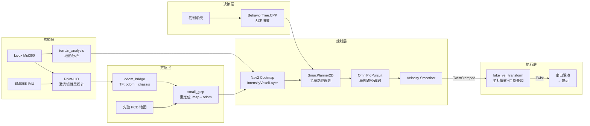

[](https://opensource.org/licenses/Apache-2.0)


# Sentry26 - ROS2 哨兵导航系统

RoboMaster 2026 赛季哨兵机器人自主导航系统。基于 ROS2 Jazzy + Nav2 + BehaviorTree.CPP，支持全向底盘、Livox Mid360 激光雷达、Gazebo Harmonic 仿真。

## 系统架构



### 速度指令链路

```
controller_server (gimbal_yaw_fake 系, TwistStamped)
  → velocity_smoother (TwistStamped)
    → cmd_vel_nav2_result (≈world 系)
      → fake_vel_transform (旋转到 gimbal_yaw 系 + 叠加 spin_speed)
        → /cmd_vel (Twist, 最终下发底盘)
```

### TF 树

```
map → odom → base_footprint → chassis → gimbal_yaw → gimbal_pitch → front_mid360
                                          ↓
                                    gimbal_yaw_fake (Nav2 规划坐标系)
```

## 功能特性

- **全向底盘导航**：OmniPidPursuit 控制器，纯平移跟踪，无差速约束
- **高频定位**：Point-LIO 激光惯性紧耦合 + small_gicp 全局重定位
- **地形感知**：基于 intensity 的体素代价地图层，支持坡道/台阶检测
- **行为决策**：BehaviorTree.CPP 行为树，支持进攻/防守/补给/巡逻状态切换
- **自旋模式**：底盘持续自转 + 云台反向稳定（fake_vel_transform 坐标补偿）
- **完整仿真**：Gazebo Harmonic 全场景仿真，含裁判系统、多机器人对抗
- **工具链**：串口 Mock、地图坐标拾取、实时数据可视化

## 目录结构

```
src/
├── sentry_nav/                  # 导航核心（元包）
│   ├── point_lio/               #   Point-LIO 激光惯性里程计
│   ├── odom_bridge/             #   里程计 → TF 桥接
│   ├── fake_vel_transform/      #   速度坐标变换 + 自旋叠加
│   ├── omni_pid_pursuit_controller/  # 全向 PID 路径跟踪
│   ├── nav2_plugins/            #   IntensityVoxelLayer + BackUpFreeSpace
│   ├── terrain_analysis/        #   地形分析
│   ├── terrain_analysis_ext/    #   地形分析扩展
│   ├── livox_ros_driver2/       #   Livox 雷达驱动
│   ├── pointcloud_to_laserscan/ #   点云 → 2D scan
│   ├── ign_sim_pointcloud_tool/ #   仿真点云格式转换
├── sentry_nav_bringup/          # Launch 文件、Nav2 参数、地图、行为树 XML
├── sentry_behavior/             # BehaviorTree.CPP 行为树插件
├── sentry_robot_description/    # 机器人 URDF/SDF 模型
├── serial/                      # rm_serial_driver 串口通信
├── rm_interfaces/               # 统一自定义消息（裁判系统 + 视觉）
├── small_gicp_relocalization/   # 全局重定位节点
├── odom_interpolator/           # 里程计插值
├── sentry_tools/                # 调试工具（串口 Mock / 地图拾取 / 数据可视化）
├── BehaviorTree.ROS2/           # BT-ROS2 集成框架
├── simulator/                   # Gazebo Harmonic 仿真环境
│   ├── rmoss_core/              #   仿真基础库
│   ├── rmoss_gazebo/            #   仿真插件（麦轮驱动/射击/灯条）
│   ├── rmoss_gz_resources/      #   场地模型资源
│   ├── rmu_gazebo_simulator/    #   RoboMaster 仿真器
│   └── sdformat_tools/          #   SDF 工具
├── scripts/                     # 环境配置脚本
└── docs/                        # 项目文档
```

## 环境要求

| 依赖 | 版本 |
|------|------|
| Ubuntu | 24.04 LTS |
| ROS2 | Jazzy |
| Gazebo | Harmonic (gz-sim 8) |
| C++ | C++17 |
| Python | 3.12+ |
| 硬件 | Livox Mid360 + 全向底盘 + BMI088 IMU |

## 编译

```bash
# 方式一：一键配置环境（推荐首次使用）
bash src/scripts/setup_env.sh

# 方式二：手动编译
rosdep install -r --from-paths src --ignore-src --rosdistro jazzy -y
pip3 install xmacro --break-system-packages
colcon build --symlink-install --cmake-args -DCMAKE_BUILD_TYPE=Release
source install/setup.bash
```

## 快速开始

### 仿真模式（三步启动）

```bash
# 终端 1：启动 Gazebo（可选 headless:=true 无 GUI）
QT_QPA_PLATFORM=xcb ros2 launch rmu_gazebo_simulator bringup_sim.launch.py

# 终端 2：等待机器人 spawn 完成后 unpause
gz service -s /world/default/control \
  --reqtype gz.msgs.WorldControl \
  --reptype gz.msgs.Boolean \
  --timeout 5000 --req 'pause: false'

# 等待 ~10 秒让仿真时钟稳定

# 终端 3：启动导航
ros2 launch sentry_nav_bringup rm_navigation_simulation_launch.py \
  world:=rmul_2026 slam:=True
```

> **注意**：必须按此顺序启动。Gazebo 未 unpause 时不产生传感器数据，Point-LIO 无法初始化。

### 实车模式

```bash
# 一键启动（含串口驱动）
ros2 launch sentry_nav_bringup rm_sentry_launch.py \
  namespace:=red_standard_robot1

# 或分步启动
# 建图模式
ros2 launch sentry_nav_bringup rm_navigation_reality_launch.py slam:=True
# 导航模式（需要先验地图和 PCD）
ros2 launch sentry_nav_bringup rm_navigation_reality_launch.py slam:=False
```

## 主要参数

| 参数 | 说明 | 默认值 |
|------|------|--------|
| `namespace` | 机器人命名空间 | `""` |
| `slam` | SLAM 建图模式 | `False` |
| `world` | 仿真世界名称 | `""` |
| `use_sim_time` | 仿真时间 | `False` |
| `use_rviz` | 启动 RViz | `True` |
| `headless` | Gazebo 无 GUI | `False` |

## 调试工具

```bash
# 串口 Mock + 地图坐标拾取（独立于 ROS）
python3 src/sentry_tools/sentry_toolbox.py

# 串口数据实时可视化（需 ROS 环境）
source install/setup.bash
python3 src/sentry_tools/serial_visualizer.py
```

详见 [sentry_tools 文档](src/sentry_tools/README.md)。

## 文档

| 文档 | 说明 |
|------|------|
| [快速部署指南](src/docs/QUICKSTART.md) | 从零开始的环境搭建与首次运行 |
| [系统架构详解](src/docs/ARCHITECTURE.md) | 各模块数据流、坐标系、接口设计 |
| [运行模式说明](src/docs/RUNNING_MODES.md) | 仿真/实车/建图/导航模式详解 |
| [参数调优指南](src/docs/TUNING_GUIDE.md) | Point-LIO / Nav2 / 控制器参数调优 |
| [远程调试指南](src/docs/REMOTE_DEBUG.md) | Foxglove 远程可视化配置 |

## 致谢

本项目参考 [深圳北理莫斯科大学 PolarBear 战队](https://github.com/SMBU-PolarBear-Robotics-Team) 开发。

## 许可证

Apache-2.0
