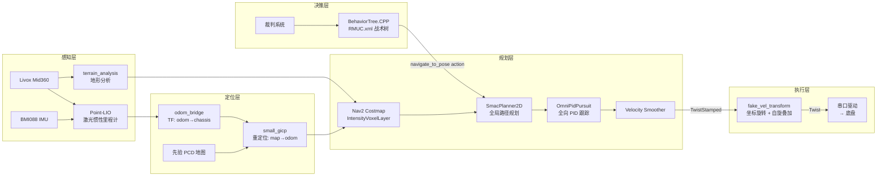

[](https://opensource.org/licenses/Apache-2.0)


# Sentry26 — RoboMaster 哨兵机器人 ROS2 自主导航系统

RoboMaster 2026 赛季哨兵机器人 ROS2 自主导航系统。**全向 (Mecanum) 底盘 + 独立云台 + 持续自旋**，基于 ROS2 Jazzy + Nav2 + BehaviorTree.CPP / BehaviorTree.ROS2 + Livox Mid360 + Gazebo Harmonic。

- **Maintainer**: Boombroke <boombroke@icloud.com>
- **基于**: [pb2025_sentry_nav](https://github.com/SMBU-PolarBear-Robotics-Team/pb2025_sentry_nav)（Lihan Chen 等）
- **当前活跃分支**: `feat/omni_controller`，全向链路完整主线

## 系统架构



### 速度指令链路

```
controller_server (gimbal_yaw_fake 系, TwistStamped)
  → cmd_vel_controller
    → velocity_smoother (TwistStamped)
      → cmd_vel_nav2_result (≈world 系)
        → fake_vel_transform (旋转到 gimbal_yaw 系 + 叠加 spin_speed)
          → /cmd_vel (Twist) → Gazebo MecanumDrive 插件 / rm_serial_driver
```

### TF 树

```
map → odom → base_footprint → chassis → gimbal_yaw → gimbal_pitch → front_mid360
                                          ↓
                                    gimbal_yaw_fake (Nav2 规划用虚拟 frame)
```

底盘持续自旋时 `gimbal_yaw` 实时变化，`gimbal_yaw_fake` 与 `gimbal_yaw` 反向旋转，使 Nav2 规划目标点保持在惯性系上稳定。`fake_vel_transform` 在执行端把 Nav2 输出从 fake 系旋回真实系并叠加 `spin_speed` 给底盘。

## 功能特性

- **全向底盘 + 持续自旋**：四麦轮（`MecanumDrive2`）支持任意方向平移；底盘以固定 `spin_speed`（默认 3.14 rad/s）持续自旋，云台反向跟随保持指向稳定
- **决策层走 Nav2 action**：`sentry_behavior` 中 `NavigateTo`（继承 `BT::RosActionNode<NavigateToPose>`）直接调用 nav2 `navigate_to_pose` action，能拿到真实 SUCCESS/FAILURE 与 feedback；不再依赖 `/goal_pose` topic publish 的"立即 SUCCESS"语义
- **Reactive 决策树**：`RMUC.xml` 用 `WhileDoElse + KeepRunningUntilFailure(NavigateTo) + AlwaysSuccess` 组合，状态条件（弹丸 / 血量）变化时立刻 halt 当前 NavigateTo + 切到补给/驻守路径
- **高频定位**：Point-LIO 激光惯性紧耦合 + small_gicp 全局重定位
- **地形感知**：基于 intensity 的体素代价地图层，支持坡道 / 台阶检测；`IntensityVoxelLayer` + `BackUpFreeSpace` 自由空间后退恢复
- **完整仿真**：Gazebo Harmonic 全场景（rmuc_2025 / rmuc_2026 / rmul_2026），含裁判系统、多机器人对抗
- **工具链**：串口 Mock、地图坐标拾取、串口实时数据可视化、INV-1~7 决策树回归脚本

## 目录结构

```
src/
├── sentry_nav/                          # 自研导航核心包容器
│   ├── odom_bridge/                     #   Point-LIO → TF / Odometry / registered_scan 桥接
│   ├── fake_vel_transform/              #   速度坐标变换 + 自旋叠加
│   ├── omni_pid_pursuit_controller/     #   全向 PID 路径跟踪控制器（Nav2 plugin）
│   ├── nav2_plugins/                    #   IntensityVoxelLayer + BackUpFreeSpace
│   ├── small_gicp_relocalization/       #   全局重定位
│   └── sentry_nav/                      #   元包（依赖聚合）
├── sentry_nav_bringup/                  # Launch / Nav2 参数 / 地图 / PCD / 行为树 XML
├── sentry_behavior/                     # BehaviorTree 战术决策（RMUC.xml + 3 个核心 plugin）
├── sentry_motion_manager/               # 速度仲裁器（急停 / 手动 / recovery / nav）
├── sentry_match_recorder/               # 比赛期间自动 rosbag 录制
├── sentry_robot_description/            # 机器人 SDF/xmacro 描述
├── sentry_tools/                        # 串口 Mock / 地图编辑 / 数据可视化
├── serial/                              # rm_serial_driver（v3.0 多包协议）
├── rm_interfaces/                       # 自定义消息（裁判系统 / 视觉）
├── odom_interpolator/                   # Nav2 高频反馈用里程计插值
├── BehaviorTree.ROS2/                   # in-tree behaviortree_ros2 0.3.0
├── third_party/                         # 上游 Point-LIO / livox / pointcloud_to_laserscan / Multi_LiCa
├── simulator/                           # Gazebo Harmonic 仿真栈（rmoss_*）
├── scripts/                             # 环境配置与修复脚本
└── docs/                                # 项目级文档
tests/                                   # INV-1~7 决策树回归脚本 + mock action server
```

## 环境要求

| 依赖 | 版本 |
|------|------|
| Ubuntu | 24.04 LTS |
| ROS2 | Jazzy |
| Gazebo | Harmonic (gz-sim 8) |
| C++ | C++17 |
| Python | 3.12+ |
| 硬件 | Livox Mid360 + 麦轮全向底盘 + BMI088 IMU |

## 编译

```bash
# 一键配置环境
bash src/scripts/setup_env.sh

# 增量编译
colcon build --symlink-install --cmake-args -DCMAKE_BUILD_TYPE=Release
source install/setup.bash

# 单包编译
colcon build --packages-select sentry_behavior --symlink-install --cmake-args -DCMAKE_BUILD_TYPE=Release
```

> **OOM 预防**：`btcpp_ros2_interfaces` / `rm_interfaces` 等 IDL 包 Python binding 内存占用大。全量并行在 16G 内存机器上易 OOM，必要时加 `--parallel-workers 4` 或 `--executor sequential`。

## 快速开始

### 仿真模式（两步启动 / 时序敏感）

```bash
# 终端 1：启动 Gazebo（首次跑加 headless:=true 更稳）
QT_QPA_PLATFORM=xcb ros2 launch rmu_gazebo_simulator bringup_sim.launch.py

# 等机器人 spawn 后 unpause
gz service -s /world/default/control \
  --reqtype gz.msgs.WorldControl --reptype gz.msgs.Boolean \
  --timeout 5000 --req 'pause: false'

# 等 ~10s 让仿真时钟稳定

# 终端 2：启动导航栈（首次跑用 slam:=True 实时建图，有图后切 False）
ros2 launch sentry_nav_bringup rm_navigation_simulation_launch.py \
  world:=rmuc_2026 slam:=True
```

支持的世界：`rmuc_2025` / `rmuc_2026` / `rmul_2026`。默认 `rmuc_2025`。

### 实车模式

```bash
# 实车一键启动（含串口 + 决策树）
ros2 launch sentry_nav_bringup rm_sentry_launch.py

# 或分步：建图
ros2 launch sentry_nav_bringup rm_navigation_reality_launch.py slam:=True use_robot_state_pub:=True

# 或分步：导航（需先验地图 + PCD）
ros2 launch sentry_nav_bringup rm_navigation_reality_launch.py slam:=False world:=<WORLD_NAME> use_robot_state_pub:=True
```

## 主要参数

| 参数 | 说明 | 默认值 |
|------|------|--------|
| `namespace` | 机器人命名空间 | `""` |
| `world` | 仿真 / 实车世界名称 | `rmuc_2025` |
| `slam` | SLAM 建图模式 | `False` |
| `use_sim_time` | 仿真时间 | `False` |
| `use_rviz` | 启动 RViz | `True` |
| `headless` | Gazebo 无 GUI | `False` |
| `enable_recorder` | 比赛自动录包（实车 launch） | `True` |
| `enable_behavior` | 启动 sentry_behavior 决策（实车 launch） | `False` |
| `target_tree` | 决策树名（XML 中 BehaviorTree ID） | `rmuc_2026_sentry` |

## 决策树回归测试

`tests/inv_smoke.sh` 用 mock NavigateToPose action server 验证 `RMUC.xml` 在七条不变量（INV-1~7）下的行为不变性。新会话 / 重构前后跑这套确认决策语义未漂移：

```bash
source install/setup.bash

# 录基线（重构前）
tests/inv_smoke.sh --baseline tests/baseline

# 回归对比（重构后）
tests/inv_smoke.sh --regress tests/baseline

# 单跑（不录、不比对）
tests/inv_smoke.sh
```

七条不变量：阶段判定 / 首点压制 / 弹尽切补给 / 三段流转 / 阶段二驻守与回补给 / 比赛结束 / server 重启稳定性。

## 调试工具

```bash
# 串口 Mock + 地图坐标拾取（独立于 ROS）
python3 src/sentry_tools/sentry_toolbox.py

# 串口数据实时可视化（需 ROS 环境）
source install/setup.bash
python3 src/sentry_tools/serial_visualizer.py
```

详见 [sentry_tools 文档](src/sentry_tools/README.md)。

## 文档

| 文档 | 说明 |
|------|------|
| [快速部署指南](src/docs/QUICKSTART.md) | 从零开始的环境搭建与首次运行 |
| [系统架构详解](src/docs/ARCHITECTURE.md) | 各模块数据流、坐标系、接口设计 |
| [运行模式说明](src/docs/RUNNING_MODES.md) | 仿真 / 实车 / 建图 / 导航模式详解 |
| [参数调优指南](src/docs/TUNING_GUIDE.md) | Point-LIO / Nav2 / OmniPidPursuit 参数调优 |
| [远程调试指南](src/docs/REMOTE_DEBUG.md) | Foxglove 远程可视化配置 |
| [决策树包说明](src/sentry_behavior/README.md) | RMUC.xml + NavigateTo + IsStatusOK / IsGameStatus |
| [Nav2 启动包说明](src/sentry_nav_bringup/README.md) | launch / nav2_params 结构 |

## 致谢

本项目参考 [深圳北理莫斯科大学 PolarBear 战队](https://github.com/SMBU-PolarBear-Robotics-Team) 开发，原作者：Lihan Chen 等。当前由 Boombroke 维护并适配 RoboMaster 2026 赛季。

## 许可证

Apache-2.0
